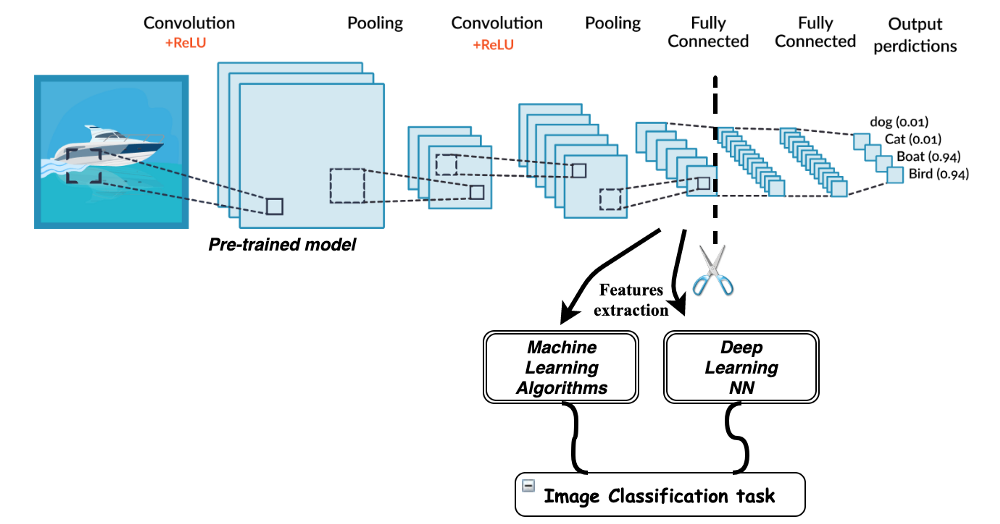

[//]: # (Image References)

[image1]: ./images/sample_dog_output.png "Sample Output"
[image2]: ./images/vgg16_model.png "VGG-16 Model Keras Layers"
[image3]: ./images/vgg16_model_draw.png "VGG16 Model Figure"

## Project Overview

Welcome to the Convolutional Neural Networks (CNN) project! In this project, you will learn how to build a pipeline that can be used within a web or mobile app to process real-world, user-supplied images.  Given an image of a dog, your algorithm will identify an estimate of the canine’s breed.  If supplied an image of a human, the code will identify the resembling dog breed.  

![Sample Output][image1]

## Table of contents
* [Helpful Link For The Project](#Helpful-Link-For-The-Project)
* [File Descriptions](#File-Descriptions)
* [Contents](#Contents)
* [Results](#Results)
* [Technologies](#technologies)
* [Contact](#Contact)

## Helpful Link For The Project:

Convolutional Neural Networks (CNNs) are commonly used to analyse image data. You can find more information about their on [Wikipedia](https://en.wikipedia.org/wiki/Convolutional_neural_network).

Transfer Learning is a Machine Learning method where a model developed for a task is reused as the starting point for a model on a second task. It is a popular approach in Deep Learning where pre-trained models are used as the starting point on computer vision and natural language processing tasks given the vast compute and time resources required to develop neural network models on these problems and from the huge jumps in a skill that they provide on related problems.
You can find more information [on  this blog](https://mc.ai/transfer-learning-with-deep-learning-machine-learning-techniques/)
.

## File descriptions
* dog_app.ipynb: Jupyter notebook containing the algorithm and process used to create it.
* dog_app.html: A copy of dog_app.ipynb in html format.
* Haarcascades folder: Xml file for use with the OpenCv face detector class.
* Various images: Images in jpg and jpeg format used to test the algorithm's predictions.

## Contents
The project is organized along the following steps:

'''Intro
Step 0: Import Datasets
Step 1: Detect Humans
Step 2: Detect Dog
Step 3: Create a CNN to Classify Dog Breeds (from Scratch)
Step 4: Create a CNN to Classify Dog Breeds (using Transfer Learning)
Step 5: Write Your Algorithm
Step 6: Test Your Algorithm'''

## Technologies
### Languages
Project is created with Python 3.6.9.

### Dependencies

* [NumPy](https://numpy.org)
* [Matplotlib](https://matplotlib.org)
* [pandas](https://pandas.pydata.org)
* [OpenCV](https://opencv.org/)
* [Keras](https://keras.io/)

## Contact

* Mail: isaaccohensabban_at_gmail_dot_com

